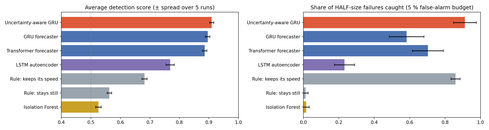

# Detecting Robot Failures by Learning How a Robot Normally Moves

Master's thesis project on the **RoboAI UR5e dataset**.

**Main question:** can a model that has only seen a robot working normally tell us when something goes wrong?

**Idea:** a model learns to predict the robot's next moves. When the robot moves in a way the model did not expect (a bump, a freeze, slow drift, a faulty sensor), it raises an alarm.

## Research questions

| | Question | Status |
|---|---|---|
| RQ1 | How accurately can the robot's future motion be predicted? | answered |
| RQ2 | Can prediction errors detect failures, how early, and which method works best? | answered |
| RQ3 | Does a model that also estimates how sure it is (uncertainty-aware) reduce false alarms? | answered |

## Results

All numbers are the **average of 5 runs**, each with a different random split into training (70 %), validation (15 %) and test (15 %) recordings. The ± value is the spread between runs. Failures (bump, freeze, drift, sensor noise) were added to test recordings that the methods never saw during training.

### RQ1 — How accurately can the motion be predicted?

Error of the predicted hand position:

| Method | 1 step ahead | 10 steps ahead |
|---|---|---|
| GRU | 1.0 ± 0.1 mm | **15.6 ± 1.3 mm** |
| Transformer | 0.9 ± 0.0 mm | 16.7 ± 0.7 mm |
| Uncertainty-aware GRU | 1.1 ± 0.1 mm | 17.6 ± 0.8 mm |
| Rule: keeps its speed | 1.6 ± 0.1 mm | 59.2 ± 1.7 mm |
| Rule: stays still | 6.8 ± 0.2 mm | 66.0 ± 1.5 mm |

**Answer:** yes. Learned models are about **4 times more accurate** than simple rules 10 steps ahead.

### RQ2 — Which method detects failures best?

Detection score (ROC-AUC): 1.0 = perfect, 0.5 = guessing.

| Method | Average | Freeze | Drift | Bump | Noise |
|---|---|---|---|---|---|
| **Uncertainty-aware GRU (new)** | **0.910 ± 0.007** | 0.78 | **0.89** | 0.98 | 0.99 |
| GRU | 0.896 ± 0.008 | **0.81** | 0.81 | 0.97 | 0.99 |
| Transformer | 0.886 ± 0.007 | 0.77 | 0.81 | 0.98 | 0.99 |
| LSTM autoencoder | 0.769 ± 0.014 | 0.35 | 0.82 | 0.94 | 0.97 |
| Rule: keeps its speed | 0.682 ± 0.009 | 0.28 | 0.47 | 0.98 | 0.99 |
| Rule: stays still | 0.563 ± 0.008 | 0.11 | 0.54 | 0.69 | 0.92 |
| Isolation Forest | 0.526 ± 0.010 | 0.16 | 0.52 | 0.60 | 0.83 |

**Answer:**
- **Fast failures** (bump, noise) are easy: a simple rule already scores 0.99.
- **Slow failures** (freeze, drift) need a learned model: **0.83** for the best method versus **0.38** for the best rule.
- Isolation Forest and the LSTM autoencoder are clearly weaker.



### RQ3 — Does knowing "how sure it is" reduce false alarms?

| Measure | GRU | Uncertainty-aware GRU | Runs won by the new model |
|---|---|---|---|
| False alarms when 90 % of failures are caught (lower = better) | 0.212 ± 0.026 | 0.215 ± 0.025 | 1 of 5 |
| Detection score (higher = better) | 0.896 ± 0.008 | **0.910 ± 0.007** | **5 of 5** |
| Half-size failures caught (higher = better) | 58 % ± 10 | **91 % ± 6** | **5 of 5** |

**Answer:** mixed.
- It does **not** reduce false alarms, so the hypothesis is not supported.
- It **detects better in every run**, especially small failures and slow drift.
- It is slightly worse on freezes (0.78 vs 0.81).
- Its uncertainty changes little over time, so the gain may come from better scaling of each value rather than from knowing *when* it is unsure. This is still to be analysed.

### Real recordings

The best method ranked all 443 real recordings by how unusual they are. Only 10 of the 443 cross the alarm threshold. The top 3 were checked on camera, and none of them is a real failure:
- **Recording 293:** a tiny movement (0.04°) of a wrist joint that almost never moves elsewhere. Scaling makes this tiny movement look huge. Fix: give near-constant values a minimum scale.
- **Recordings 436 and 416:** unusually fast starts (16–17 mm per step versus a typical 4–6 mm).

### Data findings

- **359 orientation sign flips** had to be fixed, or they look like fake failures.
- The dataset's **"commands" are just the recorded movement** written a second time. They add no information, and using them carelessly makes results look far better than they are.

## Files

| File | What it is |
|---|---|
| `dataset_review_and_project.ipynb` | **Start here.** Explains the dataset and the project step by step |
| `option1_motion_anomaly_detection.ipynb` | The full method explained cell by cell for one run |
| `option1_final_experiments.ipynb` | Final results: the new uncertainty-aware model, 5 repeated runs, real recordings with camera frames |
| `option1_core.py` | Shared code used by the final experiments notebook |
| `thesis_proposal.docx` | One-page thesis proposal |
| `processed/robot_motion.npz` | Robot numbers extracted from the dataset (4 MB) |
| `results/` | Result tables (CSV) and figures; files starting with `final_` are the 5-run results |
| `dataset/` | Dataset description files; the data files themselves are not in Git |

## How to run

1. Install Python 3.10 or newer, then the libraries:
   ```
   pip install -r requirements.txt
   ```
   For a GPU, install PyTorch with CUDA from <https://pytorch.org> first. A GPU is optional; everything runs on a normal laptop in a few minutes.

2. Open the notebooks in VS Code or Jupyter and run them from top to bottom.

The experiments only need `processed/robot_motion.npz`, which is already included. The full dataset (about 24 GB) is only needed to show camera images or to re-create that file. To get it, download it from <https://huggingface.co/datasets/Rouhis/RoboAI_UR5e> and put the files from `robo_ai_u_r5e/1.0.0/` into the `dataset/` folder.

## Dataset

Rouhiainen, J. (2025). *RoboAI UR5e Dataset.* RoboAI Research Center, Satakunta University of Applied Sciences. License: CC BY 4.0.
